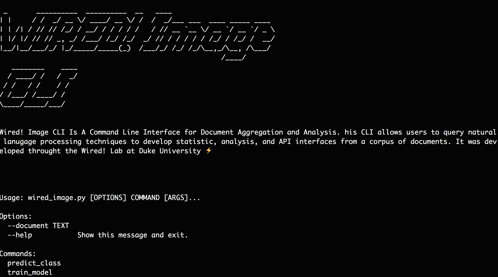

# Wired Image CLI
> A Command Line Interface for Image Analysis


This is a CLI for image analysis. This CLI allows users to develop image categorization and object detection interfaces from a folder of images. It was developed throught the [Wired!](http://www.dukewired.org/) Lab at Duke University



## Installation

OS X & Linux:

```sh
pip install wired_image_cli
```

## Development

OS X & Linux:

```sh
python wired__image.py --help
```


## Usage example: Here are the questions one can answer with Wired Image CLI

#### Complete :white_check_mark: -- In Progress :small_red_triangle_down:

### What category does this image belong to? :white_check_mark:
### What images are similar to this image? :small_red_triangle_down:
### What objects are in this image? :small_red_triangle_down:

_For more examples and usage, please refer to the [Wiki][wiki]._

## Release History

* 0.0.1
    * Work in progress

## Meta

Matthew Kenney– [@matthewbay](https://twitter.com/matthewbay) – mk365@duke.edu

[https://github.com/dukewired/wired_cli](https://github.com/dukewired/wired_cli)

## Contributing

1. Fork it (<https://github.com/dukewired/wired_cli/fork>)
2. Create your feature branch (`git checkout -b feature/fooBar`)
3. Commit your changes (`git commit -am 'Add some fooBar'`)
4. Push to the branch (`git push origin feature/fooBar`)
5. Create a new Pull Request